# Hellobot - A Cloud-Native File Processing Service

## Introduction

This project is a sample implementation of a standard, large-scale file processing workflow, inspired by the architecture you proposed. A live demo is available at: [hellobot.zetx.tech](https://hellobot.zetx.tech/)

This service provides a simple yet powerful function: for any number and size of files uploaded by the user, it adds a "Hello\! " prefix to the beginning of each line.

The entire service is deployed on AWS (Amazon Web Services), leveraging a fully **Serverless** and **Cloud-Native** architecture to achieve high elasticity, availability, and cost-efficiency.

## Architecture

### Brief Overview

The entire system is event-driven. Core components are decoupled via S3 events and SQS messages, enabling massive scalability.

You can find the source code for all Lambda functions in the `aws/lambdas` directory of this project.

```mermaid
graph LR
    User["<fa:fa-user> User / Client"]

    subgraph "AWS Cloud Infrastructure"
        API["<fa:fa-server> API Gateway"]
        Engine["<fa:fa-cogs> Async Processing Engine<br>(Lambda)"]
        S3["<fa:fa-database> S3 Storage"]
        DB["<fa:fa-table> Job Status Tracker<br>(DynamoDB)"]
        Error["<fa:fa-bug> Error Handler"]
    end

    %% --- Workflow ---
    User -- "Get URL / Check Status" --> API
    User -- "Upload File" --> S3
    
    API -- "Reads / Updates" --> DB
    API -- "Generates URL for" --> S3
    
    S3 -- "Triggers Processing" --> Engine
    
    Engine -- "Processes Chunks via" --> S3
    Engine -- "Updates Status in" --> DB
    Engine -- "Writes Final Result to" --> S3
    
    User -- "Download Result from" --> S3

    %% --- Error Handling ---
    Engine -- "On Failure / Timeout" --> Error
    Error -- "Marks Job as FAILED in" --> DB


    %% --- Styling ---
    classDef user fill:#e9f5ff,stroke:#005ea2,stroke-width:2px;
    classDef default fill:#f9f9f9,stroke:#333;
    classDef api fill:#9C27B0,stroke:#333,stroke-width:2px,color:white;
    classDef engine fill:#FF9900,stroke:#333,stroke-width:2px,color:white;
    classDef storage fill:#2E73B8,stroke:#333,stroke-width:2px,color:white;
    classDef db fill:#3F8627,stroke:#333,stroke-width:2px,color:white;
    classDef error fill:#D82231,stroke:#333,stroke-width:2px,color:white;

    class User user;
    class API api;
    class Engine engine;
    class S3 storage;
    class DB db;
    class Error error;
```

Click to expand/collapse the Mini Architecture Diagram

**The main processing flow is as follows:**

1.  **Get Upload Link**: The user's browser application calls our API Gateway to obtain a secure S3 Presigned URL for file upload.
2.  **Upload & Trigger**: The user uploads the file directly to an S3 bucket using the presigned URL. Upon successful upload, an S3 event automatically triggers the `FileOrchestrator` Lambda function, kicking off the backend process.
3.  **Orchestration & Dispatch**: The `FileOrchestrator` function reads the file's metadata (e.g., size), logically splits the large file into smaller chunks (e.g., 1 MB each), and sends a message for each chunk to an SQS (Simple Queue Service) queue.
4.  **Parallel Processing**: Messages in the SQS queue trigger the `ChunkProcessor` Lambda function. Thanks to Lambda's elastic scaling, hundreds or thousands of `ChunkProcessor` instances can be invoked concurrently to process all chunks in parallel. Each function processes its data chunk and saves the result as a temporary part file in S3.
5.  **Assembly & Cleanup**: After a `ChunkProcessor` instance completes its task, it immediately updates the job's progress in DynamoDB. It then performs a check to see if all chunks for the original file have been processed. Only when all chunks are reported as complete is the `SingleFilePackager` Lambda function invoked. This function assembles all temporary result parts into a final, complete file, updates the overall task status to "COMPLETED," and finally, cleans up all temporary parts and the original uploaded file.
6.  **Status Check & Download**: Throughout the process, the user can poll an API endpoint to check the job status. Upon completion, the user receives a download link for the final processed file.

### Complete Architecture

The following diagram provides a detailed blueprint of all service components, triggers, and data flows, suitable for development and operational reference.

```mermaid
graph TD
    %% Define styles for different components
    classDef lambda fill:#FF9900,stroke:#333,stroke-width:2px;
    classDef s3 fill:#2E73B8,stroke:#333,stroke-width:2px,color:white;
    classDef sqs fill:#D82231,stroke:#333,stroke-width:2px,color:white;
    classDef db fill:#3F8627,stroke:#333,stroke-width:2px,color:white;
    classDef api fill:#9C27B0,stroke:#333,stroke-width:2px,color:white;
    classDef event fill:#BDBDBD,stroke:#333,stroke-width:2px;
    classDef user fill:#FFFFFF,stroke:#333,stroke-width:2px;

    %% Main State Store
    DynamoDB["<fa:fa-table> DynamoDB Table<br><i>(Tasks & Status)</i>"]:::db

    subgraph "1\. API Layer & User Interaction"
        direction TB
        User["<fa:fa-user> Client/User"]:::user
        APIGW["<fa:fa-server> HellobotAPI<br>(API Gateway)"]:::api

        subgraph "API-Triggered Functions"
            direction RL
            L_GetUpload["<fa:fa-bolt> getUploadUrl"]:::lambda
            L_GetStatus["<fa:fa-bolt> getJobStatus"]:::lambda
            L_CreateZip["<fa:fa-bolt> CreateZipPackage"]:::lambda
        end
        
        User -- "POST /get-upload-url" --> APIGW
        APIGW --> L_GetUpload
        L_GetUpload -- "1\. Creates 'PENDING' task" --> DynamoDB
        L_GetUpload -- "2\. Returns S3 Presigned URL" --> APIGW
        User -- "3\. Uploads file via URL" --> S3_Upload

        User -- "GET /get-job-status" --> APIGW
        APIGW --> L_GetStatus
        L_GetStatus -- "Reads task" --> DynamoDB
        
        User -- "POST /create-zip-package" --> APIGW
        APIGW --> L_CreateZip
    end
    
    subgraph "2\. Asynchronous Processing Pipeline"
        direction TB
        S3_Upload["<fa:fa-database> UPLOAD_BUCKET<br><i>(Raw user files)</i>"]:::s3
        L_Orchestrator["<fa:fa-bolt> FileOrchestrator"]:::lambda
        SQS_Queue["<fa:fa-comments> SQS Queue<br><i>(Chunk processing jobs)</i>"]:::sqs
        L_Processor["<fa:fa-bolt> ChunkProcessor"]:::lambda
        S3_Parts["<fa:fa-database> PROCESSED_PARTS_BUCKET<br><i>(Temporary processed chunks)</i>"]:::s3

        S3_Upload -- "4\. S3 ObjectCreated Trigger" --> L_Orchestrator
        L_Orchestrator -- "Reads metadata" --> S3_Upload
        L_Orchestrator -- "5\. Updates task to 'PROCESSING'" --> DynamoDB
        L_Orchestrator -- "6\. Sends messages for each chunk" --> SQS_Queue
        SQS_Queue -- "7\. SQS Trigger (in batches)" --> L_Processor
        L_Processor -- "Reads byte-range from" --> S3_Upload
        L_Processor -- "8\. Writes processed part to" --> S3_Parts
        L_Processor -- "9\. Increments completedChunks in" --> DynamoDB
        L_Processor -- "10\. On completion, invokes..." --> L_Packager
    end

    subgraph "3\. Finalization & Output"
        direction TB
        L_Packager["<fa:fa-bolt> SingleFilePackager<br><i>(Assembler & Cleaner)</i>"]:::lambda
        S3_Individual["<fa:fa-database> PROCESSED_INDIVIDUAL_BUCKET<br><i>(Final processed files)</i>"]:::s3
        S3_Packaged["<fa:fa-database> PACKAGED_RESULTS_BUCKET<br><i>(Zipped archives)</i>"]:::s3

        L_Packager -- "11\. Reads all parts for task from" --> S3_Parts
        L_Packager -- "12\. Writes final reassembled file to" --> S3_Individual
        L_Packager -- "13\. Updates task to 'COMPLETED'<br>with presigned URL" --> DynamoDB
        L_Packager -- "14\. Cleans up parts from" --> S3_Parts
        L_Packager -- "15\. Cleans up original file from" --> S3_Upload
        
        L_CreateZip -- "Reads individual files from" --> S3_Individual
        L_CreateZip -- "Writes ZIP file to" --> S3_Packaged
        S3_Packaged -- "Returns download URL via" --> L_CreateZip
    end

    subgraph "4\. Error & Timeout Handling"
        direction TB
        SQS_DLQ["<fa:fa-bug> SQS Dead-Letter Queue"]:::sqs
        L_Failure["<fa:fa-bolt> FailureHandler"]:::lambda
        EventBridge["<fa:fa-clock> EventBridge Scheduler"]:::event
        L_StuckCleaner["<fa:fa-bolt> StuckTaskCleaner"]:::lambda

        SQS_Queue -- "On message failure" --> SQS_DLQ
        SQS_DLQ -- "DLQ Trigger" --> L_Failure
        L_Failure -- "Updates task to 'FAILED'" --> DynamoDB
        L_Failure -- "Invokes for cleanup" --> L_Packager

        EventBridge -- "Scheduled trigger (e.g., every 2 hours)" --> L_StuckCleaner
        L_StuckCleaner -- "Queries for stuck 'PROCESSING' tasks from" --> DynamoDB
        L_StuckCleaner -- "Updates task to 'FAILED'" --> DynamoDB
        L_StuckCleaner -- "Invokes for cleanup" --> L_Packager
    end
```

Click to expand/collapse the Complete Architecture Diagram

## Frontend

We use the **Vue.js** and **Tailwind.css** framework to build a modern and responsive user interface.

The frontend project is deployed via **AWS Amplify**, which hosts the static web application on a global CDN, providing low-latency access for users worldwide and integrating seamlessly with the backend services.

You can find the complete frontend source code in the `frontend` directory of this project.

## Permissions

To adhere to the **Principle of Least Privilege**, we use a separation of permissions for Lambda functions with different responsibilities. The system primarily creates three IAM Roles:

1.  **`HellobotLambdaUploadStatusRole`**:

      * **Purpose**: Assigned to user-facing functions directly triggered by API Gateway, such as `getUploadUrl` and `getJobStatus`.
      * **Permissions**: Highly restricted permissions, only allowing the creation/reading of task items in DynamoDB and the generation of S3 presigned URLs for uploads.

2.  **`HellobotLambdaCreateZipRole`**:

      * **Purpose**: Specifically assigned to the `CreateZipPackage` function.
      * **Permissions**: Allows reading files from the final results S3 bucket and writing the generated ZIP archive to the packaged results S3 bucket.

3.  **`HellobotLambdaRole`**:

      * **Purpose**: This is the internal role assigned to the core backend processing pipeline (e.g., `FileOrchestrator`, `ChunkProcessor`, `SingleFilePackager`).
      * **Permissions**: Possesses broader permissions required to execute the core business logic, including reading/writing to multiple S3 buckets, sending/receiving SQS messages, updating DynamoDB, and invoking other Lambda functions.